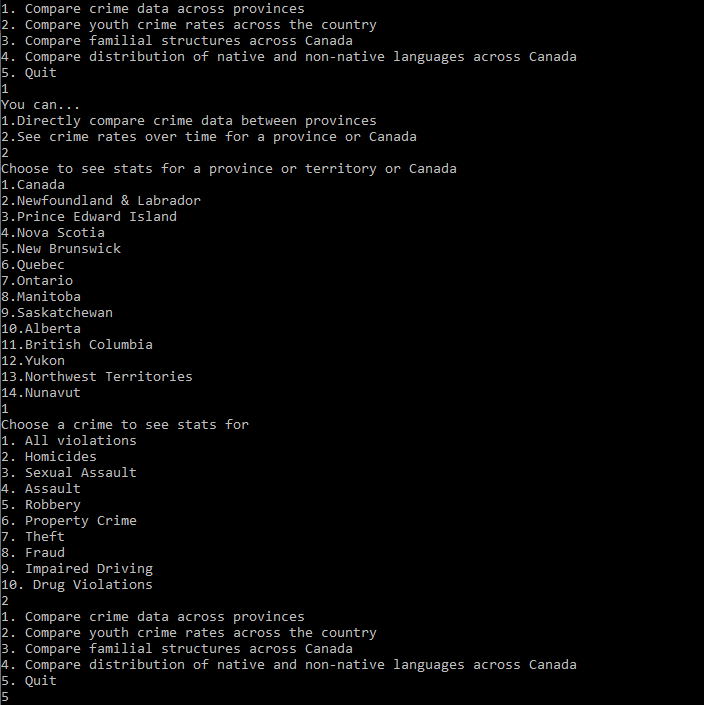
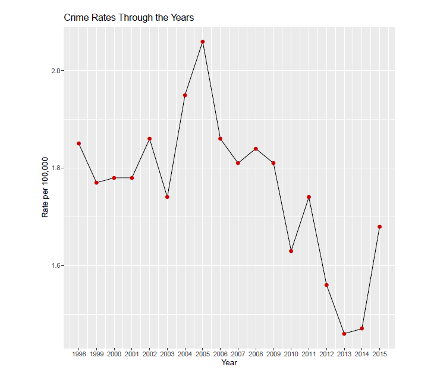

# CrimeCalculatorCanada

This is a cumulative project created for CIS2250 (Software Design II). 
It is an interactive program that uses crime and census data from Stats Canada so that users can view and access data that they need. 

Contributers:

Kanza S.
Israa S.
Mark C.
Parth P.
